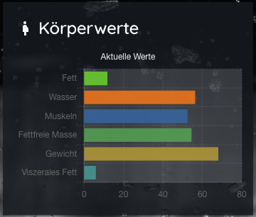
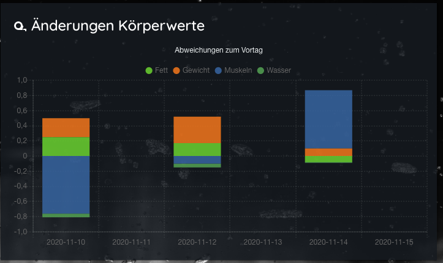
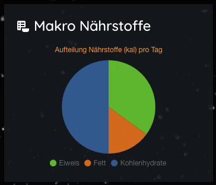
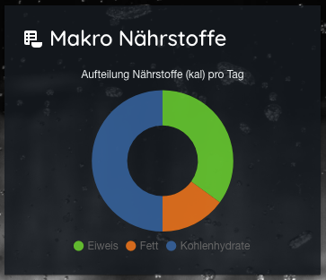
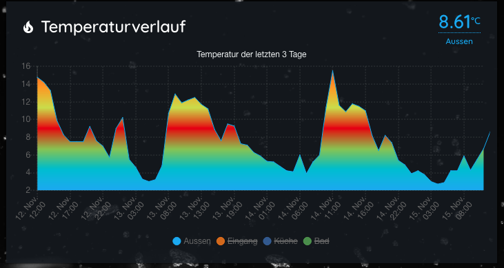
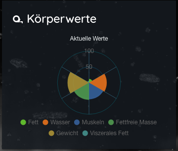
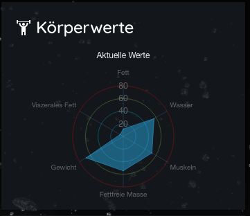
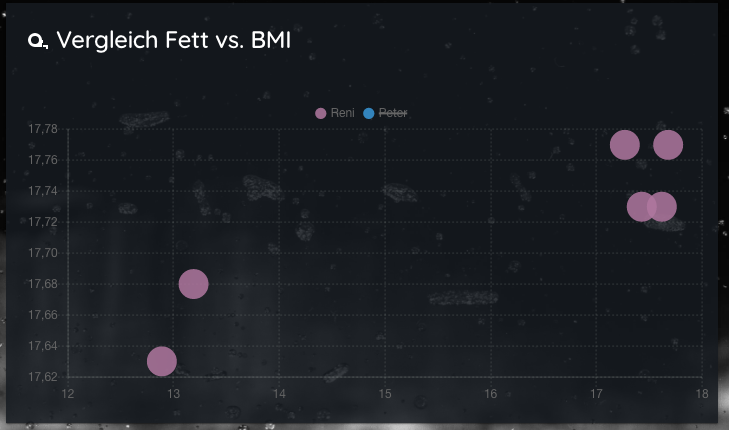
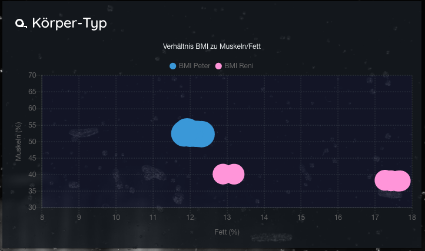
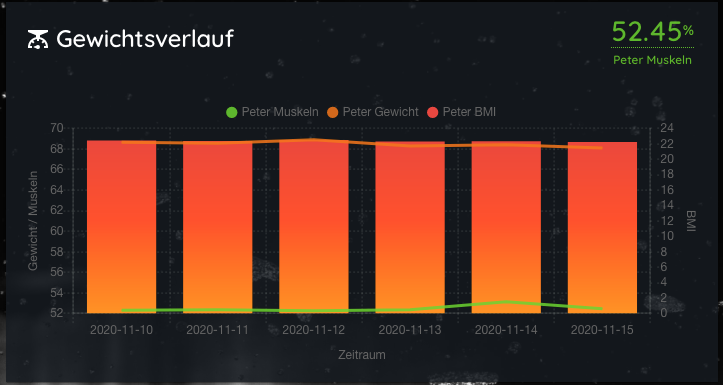

# Chart types & datasource

## Bar Chart vertical

### Data Structure

The `data` property of a dataset for a bar chart is specified as an array of numbers. Each point in the data array corresponds to the label at the same index on the x axis.

```javascript
data: [20, 10]
```

You can also specify the dataset as x/y coordinates when using the [time scale](https://www.chartjs.org/docs/latest/axes/cartesian/time.html#time-cartesian-axis).

```javascript
data: [{x:'2016-12-25', y:20}, {x:'2016-12-26', y:10}]
```


### Lovelace - Card Settings

```yaml
    ## --------------------------------
    ## chart: 'bar' simple
    ## --------------------------------
    - type: 'custom:chart-card'
    title: 'Makro Nährstoffe'
    icon: 'mdi:nutrition'
    height: 240
    chart: 'bar'
    units: 'kal'
    options:
        title:
        display: true
        text: 'Aufteilung Nährstoffe (kal) pro Tag'
    entities:
        - entity: sensor.peter_eiweis_makronahrstoff
          name: Eiweis
          backgroundColor: '#f1c40f'
        - entity: sensor.peter_fett_makronahrstoff
          name: Fett
          backgroundColor: '#e74c3c'
        - entity: sensor.peter_kohlenhydrate_makronahrstoff
          name: Kohlenhydrate
          backgroundColor: '#009688'
```

```javascript
var data = {
    labels: ['Eiweis', 'Fett', 'Kohlenhydrate'],
    datasets: [{
        label: 'Dataset 1',
        backgroundColor: ['#03a9f4', '#00bcd4', '#8bc34a'],
        borderWidth: 0,
        data: [869, 373, 1242]
    }]
}
```

## Bar Chart horizontal

The configuration options for the horizontal bar chart are the same as for the [bar chart](https://www.chartjs.org/docs/latest/charts/bar.html#scale-configuration). However, any options specified on the x axis in a bar chart, are applied to the y axis in a horizontal bar chart.



### Lovelace - Card Settings

```yaml
    ## --------------------------------
    ## chart: 'horizontalBar' 
    ## --------------------------------
    - type: 'custom:chart-card'
      title: 'Körperwerte'
      icon: 'mdi:human-pregnant'
      height: 240
      chart: 'horizontalBar'
      options:
        title:
        text: 'Aktuelle Werte'
        chartArea:
           backgroundColor: 'rgba(255,255,255,0.15)'
        entities:
          - entity: sensor.peter_koperfett
            name: Fett
          - entity: sensor.peter_korperwasser
            name: Wasser
          - entity: sensor.peter_muskeln
            name: Muskeln
          - entity: sensor.peter_fettfreie_korpermasse
            name: Fettfreie Masse
          - entity: sensor.peter_gewicht
            name: Gewicht
          - entity: sensor.peter_viszerales_fett
            name: Viszerales Fett
```

```javascript
var data = {
    labels: ['Fett', 'Wasser', 'Muskeln','Fettfreie Masse','Gewicht', "Vizerales Fett],
    datasets: [{
        label: 'Dataset 1',
        backgroundColor: ['#03a9f4', '#00bcd4', '#8bc34a'],
        borderWidth: 0,
        data: [12.34, 54.20, 51.20, 52.10, 68.40, 7.34]
    }]
}
```

## Bar Stacked
Bar charts can be configured into stacked bar charts by changing the settings on the X and Y axes to enable stacking. Stacked bar charts can be used to show how one data series is made up of a number of smaller pieces.



### Lovelace - Card Settings

```yaml
        ## --------------------------------
        ## chart: 'bar' stacked
        ## --------------------------------    
        - type: 'custom:chart-card'
          title: 'Änderungen Körperwerte'
          icon: 'mdi:tape-measure'
          height: 360
          hours_to_show: 400 
          chart: 'bar'
          options:
            title:
              text: 'Abweichungen zum Vortag'
            legend:
              position: 'top'
            scales:
              x:
                stacked: true
              y:
                stacked: true
        entities:
            - entity: sensor.peter_trend_fett
              name: Fett
            - entity: sensor.peter_trend_gewicht
              name: Gewicht
            - entity: sensor.peter_trend_muskeln
              name: Muskeln
            - entity: sensor.peter_trend_wasser
              name: Wasser

```


## Pie Chart

#### Data Structure

For a pie chart, datasets need to contain an array of data points.  The data points should be a number, Chart.js will total all of the  numbers and calculate the relative proportion of each.

You also need to specify an array of labels so that tooltips appear correctly.



### Lovelace - Card Settings

```yaml
    - type: 'custom:chart-card'
      title: 'Makro Nährstoffe'
      icon: 'mdi:nutrition'
      height: 240
      chart: 'pie'
      units: 'kal'
      options:
        title:
          display: true
          text: 'Aufteilung Nährstoffe (kal) pro Tag'
          font:
            color: '#ff9500'
      entities:
        - entity: sensor.peter_eiweis_makronahrstoff
          name: Eiweis
        - entity: sensor.peter_fett_makronahrstoff
          name: Fett
        - entity: sensor.peter_kohlenhydrate_makronahrstoff
          name: Kohlenhydrate
```

```javascript
data = {
    datasets: [{
        data: [10, 20, 30]
    }],

    // These labels appear in the legend and in the tooltips when hovering different arcs
    labels: [
        'Red',
        'Yellow',
        'Blue'
    ]
};
```


## Doughnut Chart
Doughnut charts are probably the most commonly used charts. They are divided into segments, the arc of each segment shows the proportional value of each piece of data.



### Lovelace - Card Settings

```yaml
    - type: 'custom:chart-card'
      title: 'Makro Nährstoffe'
      icon: 'mdi:nutrition'
      height: 240
      chart: 'doughnut'
      units: 'kal'
      options:
        title:
          display: true
          text: 'Aufteilung Nährstoffe (kal) pro Tag'
      entities:
        - entity: sensor.peter_eiweis_makronahrstoff
          name: Eiweis
        - entity: sensor.peter_fett_makronahrstoff
          name: Fett
        - entity: sensor.peter_kohlenhydrate_makronahrstoff
          name: Kohlenhydrate
```


## Line Chart

A line chart is a way of plotting data points on a line. Often, it is used to show trend data, or the comparison of two data sets.

## Data Structure

The `data` property of a dataset for a line chart can be passed in two formats.

```javascript
data: [20, 10]
```

When the `data` array is an array of numbers, the x axis is generally a [category](https://www.chartjs.org/docs/latest/axes/cartesian/category.html#category-cartesian-axis). The points are placed onto the axis using their position in the array. When a line chart is created with a category axis, the `labels` property of the data object must be specified.




### Lovelace - Card Settings

```yaml
        ## --------------------------------
        ## LINE CHART
        ## --------------------------------
      - type: 'custom:chart-card'
        title: 'Temperaturverlauf'
        icon: 'mdi:fire'
        height: 320
        chart: 'line'
        units: '°C'
        locale: 'de-DE'
        hours_to_show: 72
        group_by: 'hour'
        ignoreZero: true
        showstate: true
        options:
            title:
            display: true
            fontStyle: normal
            text: 'Temperatur der letzten 3 Tage'
        entities:
            - options:
                unit: '°C'
                borderWidth: 1
            - entity: sensor.temp_sensor_temperature_aussen
            fill: true
            gradient:
                colors:
                - '#03a9f4'
                - '#00bcd4'
                - '#8bc34a'
                - '#e51400'
                - '#cddc39'
                - '#ff9800'
                - '#ff5722'
            name: Aussen
            - entity: sensor.temp_sensor_temperature_eingang
            name: Eingang
            fill: true
            - entity: sensor.temp_sensor_temperature_kuche
            name: Küche
            fill: true
            - entity: sensor.temp_sensor_temperature_bad
            name: Bad
            fill: true
```

## Additional Info

### Basic
see: https://www.chartjs.org/samples/latest/charts/line/basic.html

### Multi axis
see: https://www.chartjs.org/samples/latest/charts/line/multi-axis.html

### Stepped

```javascript
    steppedLine: false      ## 'No Step Interpolation',
    steppedLine: true       ## 'Step Before Interpolation'
    steppedLine: 'before'   ## 'Step Before Interpolation'
    steppedLine: 'after'    ## 'Step After Interpolation'
    steppedLine: 'middle'   ## 'Step Middle Interpolation'
```

```javascript
datasets: [{
    label: 'steppedLine: ' + details.steppedLine,
    steppedLine: **steppedLine**,
    data: data,
    borderColor: details.color,
    fill: false,
}]
```

see: https://www.chartjs.org/samples/latest/charts/line/stepped.html

### Interpolation

```javascript
    datasets: [{
        label: 'Cubic interpolation (monotone)',
        data: datapoints,
        borderColor:'red',
        backgroundColor: 'rgba(0, 0, 0, 0)',
        fill: false,

        cubicInterpolationMode: 'monotone'  ##!!!

    }, {
        label: 'Cubic interpolation (default)',
        data: datapoints,
        borderColor: 'blue',
        backgroundColor: 'rgba(0, 0, 0, 0)',
        fill: false,

    }, {
        label: 'Linear interpolation',
        data: datapoints,
        borderColor: 'green',
        backgroundColor: 'rgba(0, 0, 0, 0)',
        fill: false,

        lineTension: 0  ##!!!

    }]
```

see: https://www.chartjs.org/samples/latest/charts/line/interpolation-modes.html


## Polar area

#### Data Structure

For a polar area chart, datasets need to contain an array of data  points. The data points should be a number, Chart.js will total all of  the numbers and calculate the relative proportion of each.

You also need to specify an array of labels so that tooltips appear correctly for each slice.



### Lovelace - Card Settings

```yaml
        ## --------------------------------
        ## chart: 'polarArea'
        ## --------------------------------
      - type: 'custom:chart-card'
        title: 'Körperwerte'
        icon: 'mdi:tape-measure'
        height: 240
        chart: 'polarArea'
        options:
            title:
            text: 'Aktuelle Werte'
            scale:
            gridLines:
                color:
                - '#03a9f4'
                - '#00bcd4'
                - '#8bc34a'
                - '#e51400'
                - '#cddc39'
                - '#ff9800'
                - '#ff5722'
            angleLines:
                color: '#5ac8fa'
        entities:
            - entity: sensor.peter_koperfett
            name: Fett
            - entity: sensor.peter_korperwasser
            name: Wasser
            - entity: sensor.peter_muskeln
            name: Muskeln
            - entity: sensor.peter_fettfreie_korpermasse
            name: Fettfreie Masse
            - entity: sensor.peter_gewicht
            name: Gewicht
            - entity: sensor.peter_viszerales_fett
            name: Viszerales Fett
```

```javascript
data = {
    datasets: [{
        data: [10, 20, 30]
    }],

    // These labels appear in the legend and in the tooltips when hovering different arcs
    labels: [
        'Red',
        'Yellow',
        'Blue'
    ]
};
```

## Radar

#### Data Structure

The `data` property of a dataset for a radar chart is  specified as an array of numbers. Each point in the data array  corresponds to the label at the same index.

```javascript
data: [20, 10]
```

For a radar chart, to provide context of what each point means, we  include an array of strings that show around each point in the chart.



### Lovelace - Card Settings

```yaml
    ## --------------------------------
    ## chart: 'radar'
    ## --------------------------------
    - type: 'custom:chart-card'
      title: 'Körperwerte'
      icon: 'mdi:weight-lifter'
      height: 240
      chart: 'radar'
      options:
        title:
          text: 'Aktuelle Werte'
        scale:
          gridLines:
            color:
              - '#03a9f4'
              - '#00bcd4'
              - '#8bc34a'
              - '#e51400'
              - '#cddc39'
              - '#ff9800'
              - '#ff5722'
          angleLines:
            color: '#5ac8fa'
      entities:
        - entity: sensor.peter_koperfett
          name: Fett
        - entity: sensor.peter_korperwasser
          name: Wasser
        - entity: sensor.peter_muskeln
          name: Muskeln
        - entity: sensor.peter_fettfreie_korpermasse
          name: Fettfreie Masse
        - entity: sensor.peter_gewicht
          name: Gewicht
        - entity: sensor.peter_viszerales_fett
          name: Viszerales Fett

```


```javascript
data: {
    labels: ['Running', 'Swimming', 'Eating', 'Cycling'],
    datasets: [{
        data: [20, 10, 4, 2]
    }]
}
```

### Scatter

#### Data Structure

Unlike the line chart where data can be supplied in two different  formats, the scatter chart only accepts data in a point format.

```javascript
data: [{
        x: 10,
        y: 20
    }, {
        x: 15,
        y: 10
    }]
```



### Lovelace - Card Settings

```yaml
      ## --------------------------------
      ## chart: 'scatter'
      ## --------------------------------
      - type: 'custom:chart-card'
        title: 'Vergleich Fett vs. BMI'
        icon: 'mdi:tape-measure'
        height: 360
        hours_to_show: 400
        chart: 'scatter'
        options:
          legend:
            position: 'top'
        entities:
          ## first holds all options
          - entity: sensor.reni_koperfett ## x-axis
            name: 'Reni'
          - entity: sensor.reni_bmi ## y-axis
          ## first holds all options
          - entity: sensor.peter_koperfett ## x-axis
            name: 'Peter'
          - entity: sensor.peter_bmi ## y-axis

```

### Bubble Chart

#### Data Structure

Bubble chart datasets need to contain a `data` array of points, each points represented by an object containing the following properties:

```javascript
{
    // X Value
    x: number,

    // Y Value
    y: number,

    // Bubble radius in pixels (not scaled).
    r: number
}
```



### Lovelace - Card Settings

```yaml
      ## --------------------------------
      ## chart: 'bubble'
      ## --------------------------------
      - type: 'custom:chart-card'
        title: 'Körper-Typ'
        icon: 'mdi:tape-measure'
        height: 360
        hours_to_show: 400
        chart: 'bubble'
        options:
          title:
            text: 'Verhältnis BMI zu Muskeln/Fett'
          legend:
            position: 'top'
          chartArea:
            backgroundColor: 'rgba(0,0,255,0.05)'
          scales:
            x:
              min: 8
              max: 18
            y:
              min: 30
              max: 70
        entities:
          ## first bubble ---------------------------
          - entity: sensor.peter_koperfett ## x-axis
            name: Fett
            unit: '%'
          - entity: sensor.peter_muskeln ## y-axis
            name: Muskeln
            unit: '%'
          ## last holds all options for the bubble
          - entity: sensor.peter_bmi ## bubble
            name: BMI Peter
            unit: 'kg'
            backgroundColor: 'rgb(52,152,219)'

          ## next bubble ---------------------------
          - entity: sensor.reni_koperfett ## x-axis
            name: Fett
            unit: '%'
          - entity: sensor.reni_muskeln ## y-axis
            name: Muskeln
            unit: '%'
          ## last holds all options for the bubble
          - entity: sensor.reni_bmi ## bubble
            name: BMI Reni
            unit: 'kg'
            backgroundColor: 'rgb(255,152,219)'

```

**Important:** the radius property, `r` is **not** scaled by the chart, it is the raw radius in pixels of the bubble that is drawn on the canvas.


##Combo Bar Line Chart



### Lovelace - Card Settings

```yaml
      ## --------------------------------
      ## MIXED CHART (LINE & BAR)
      ## --------------------------------
      - type: 'custom:chart-card'
        title: 'Gewichtsverlauf'
        icon: 'mdi:scale'
        height: 320
        chart: 'line'
        locale: 'de-DE'
        hours_to_show: 400 ## last 8 days..
        group_by: 'day'
        showstate: true
        options:
          legend:
            position: 'top'
          scales:
            x:
              scaleLabel:
                display: true
                labelString: 'Zeitraum'
            left:
              scaleLabel:
                display: true
                labelString: 'Gewicht / Muskeln'
              ticks:
                autoSkip: true
                maxTicksLimit: 12
            right:
              scaleLabel:
                display: true
                labelString: 'BMI'
              gridLines:
                drawOnChartArea: false
              ticks:
                autoSkip: true
                maxTicksLimit: 16
        entities:
          - entity: sensor.peter_muskeln
            yAxisID: 'left'
            type: 'line'
          - entity: sensor.peter_gewicht
            yAxisID: 'left'
            type: 'line'
          - entity: sensor.peter_bmi
            yAxisID: 'right'
            type: 'bar'
            fill: true
            gradient:
              colors:
                - '#ff9500'
                - '#ff5722'
                - '#e74c3c'

```

see: https://www.chartjs.org/samples/latest/charts/combo-bar-line.html

<hr>

## Datasource

| Type  | Simple Data      | Series Data      |  Remarks   |
| ----  | ----             | ----             |---- |
| bar   |  [869, 373, 1242]    |   [{869, 373, 1242},{869, 373, 1242}]   |    |
| bar horizontal    |  [869, 373, 1242]    |   [{869, 373, 1242},{869, 373, 1242}]   |    |
| pie     |  [[869, 373, 1242]    |   [{869, 373, 1242},{869, 373, 1242}]   |    |
| doughnut     |  [[869, 373, 1242]    |   [{869, 373, 1242},{869, 373, 1242}]   |    |
| line     |  [869, 373, 1242]    | ---   |   |
| lines     |  [{869, 373, 1242},{869, 373, 1242}]    | --- |  |
| ----  | ----             | ----             | |
